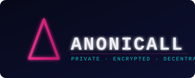

# Anonicall

  

  <strong>The privacy-first communication platform powered by blockchain authentication.</strong> 
  <em>La piattaforma di comunicazione privacy-first basata su autenticazione blockchain.</em>

  
  
  
  
  

---

## What is Anonicall?

Anonicall is an anonymous, privacy-first messaging and communication platform. Instead of email addresses or phone numbers, users authenticate using their **BSC (Binance Smart Chain) wallet signature** — no personal data required, ever.

All messages are **end-to-end encrypted** using ECDH key exchange and AES-GCM, derived deterministically from wallet signatures. This means your messages are private even from the platform itself, and your conversations sync seamlessly across all your devices.

---

*Anonicall è una piattaforma di messaggistica anonima e privacy-first. Gli utenti si autenticano tramite **firma del wallet BSC** — nessun dato personale richiesto. Tutti i messaggi sono **cifrati end-to-end** e sincronizzati su tutti i dispositivi.*

---

## Core Features

### Privacy & Security
- **Wallet-based authentication** — no email, no phone number, no personal data
- **End-to-end encryption** on all messages (ECDH + AES-GCM)
- **Anonymous profiles** with optional public/private visibility
- **Soft-delete account system** with full data erasure on request

### Communication
- **Private 1-on-1 chat** with typing indicators, read receipts, and online status
- **Voice & video calls** via WebRTC (peer-to-peer)
- **Group video meetings** via Jitsi as a Service (JaaS)
- **Media sharing** up to 25 MB per file
- **Phantom Chat** — ephemeral, random anonymous encounters
- **Chat Circuits** — Telegram-style chat folders with a cyberpunk aesthetic

### Crypto & Web3
- **Hey Money** — request and send crypto directly in chat (BNB, ETH, TRX, USDT, USDC)
- **Bridge & Swap** — cross-chain token conversion powered by LI.FI
- **Wallet Activity** — real-time incoming transaction tracking via BSCScan
- **dApp** — integrated decentralized application for token management

### AI Assistant
- **Anonicall AI** — GPT-4o powered voice and text assistant
- Voice input via Whisper (speech-to-text)
- Customizable voice and persona

### Marketplace
- **Seller storefronts** with digital products, services, and consultations
- **Reseller program** with custom invite links and commission tracking
- **Order lifecycle management** with dispute resolution

### Community
- **Topic Groups** for discussions and polls
- **Contacts system** with contact requests and public profiles
- **License system** with reseller marketplace and voucher redemption

---

## Screenshots

  
  &nbsp;
  
  &nbsp;
  
  &nbsp;
  
  &nbsp;
  
  &nbsp;
  

*From left to right: Private encrypted chat · Wallet & activity · AI assistant (JARVIS) · Marketplace shop dashboard · Hey Money crypto payments · Phantom Chat anonymous encounters.*

More assets (logos, brand colors, usage guidelines) are available in the [`press/`](./press/) folder.

---

## Live App

**[→ Open Anonicall](https://anonicall.app)**

No installation required. Connect your BSC wallet and start communicating privately.

---

## Whitepaper

The Anonicall whitepaper covers the technical architecture, encryption design, tokenomics, and business model in full detail.

- **Technical Whitepaper**: [anonicall.app/whitepaper](https://anonicall.app/whitepaper)
- **Business Whitepaper**: [anonicall.app/whitepaper-business](https://anonicall.app/whitepaper-business)
- **Repository copy**: [`WHITEPAPER.md`](./WHITEPAPER.md)

---

## Tech Stack

---

## Getting Started

1. Visit **[anonicall.app](https://anonicall.app)**
2. Connect your Binance Smart Chain wallet (MetaMask, Trust Wallet, or any WalletConnect-compatible wallet)
3. Sign the authentication message — this is your identity, no account creation needed
4. Start chatting privately

---

*Per iniziare: visita [anonicall.app](https://anonicall.app), connetti il tuo wallet BSC, firma il messaggio di autenticazione e inizia a comunicare in privato.*

---

## Repository

This repository is the **public presence** of Anonicall. The source code is proprietary and not publicly available. Here you will find:

- [`ROADMAP.md`](./ROADMAP.md) — Development roadmap by phase
- [`CHANGELOG.md`](./CHANGELOG.md) — User-facing release history
- [`SECURITY.md`](./SECURITY.md) — Security policy and responsible disclosure
- [`CONTRIBUTING.md`](./CONTRIBUTING.md) — How to contribute feedback and reports
- [`press/`](./press/) — Press kit: logos (SVG + PNG), brand colors, app screenshots, and usage guidelines → **[Download Press Kit](https://anonicall.app/press)**

---

## Contact & Community

- **App**: [anonicall.app](https://anonicall.app)
- **Security reports**: security@anonicall.app
- **Business & partnerships**: contact via the app

---

*© Anonicall. All rights reserved. Proprietary software.*
